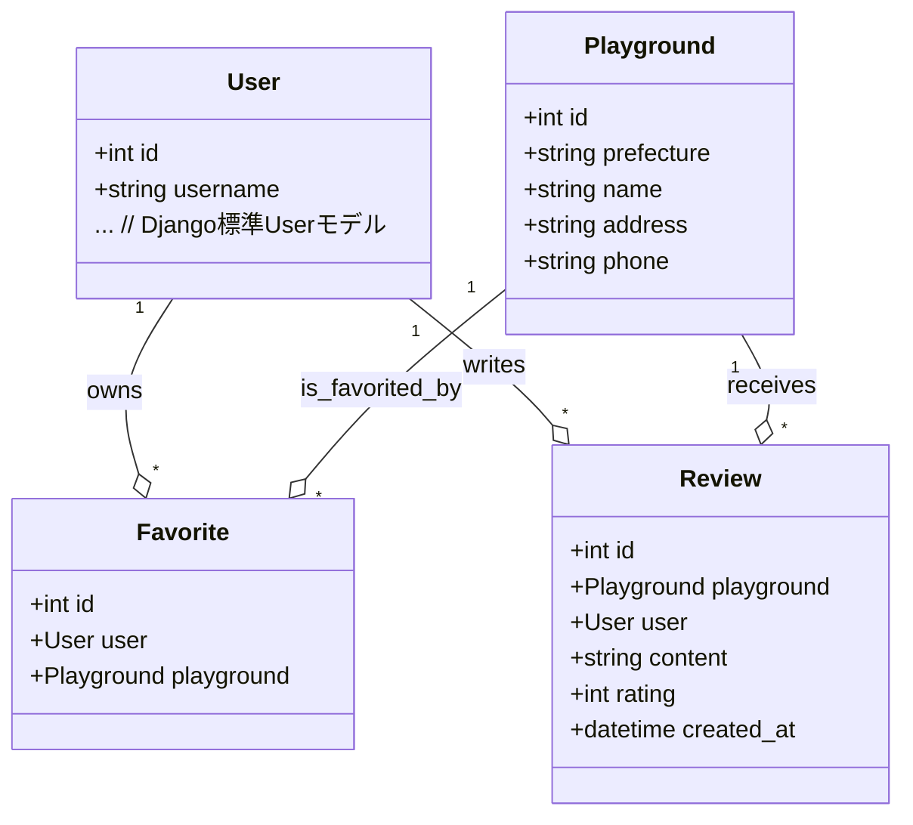

# UMLクラス図（Mermaid記法）

```mermaid
classDiagram
    class Playground {
        +int id
        +string prefecture
        +string name
        +string address
        +string phone
    }
    class Favorite {
        +int id
        +User user
        +Playground playground
    }
    class Review {
        +int id
        +Playground playground
        +User user
        +string content
        +int rating
        +datetime created_at
    }
    class User {
        +int id
        +string username
        ... // Django標準Userモデル
    }

    User "1" --o "*" Favorite : owns
    User "1" --o "*" Review : writes
    Playground "1" --o "*" Favorite : is_favorited_by
    Playground "1" --o "*" Review : receives
```

---

- UserクラスはDjango標準のUserモデルを利用しています。