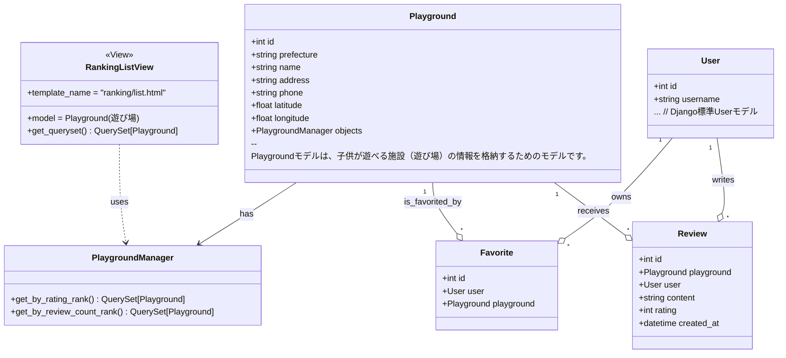

# UMLクラス図（Mermaid記法）

```mermaid
classDiagram
    class PlaygroundManager {
        +get_by_rating_rank() QuerySet[Playground]
        +get_by_review_count_rank() QuerySet[Playground]
    }
    class Playground {
        +int id
        +string prefecture
        +string name
        +string address
        +string phone
        +float latitude
        +float longitude
        +PlaygroundManager objects
        --
        Playgroundモデルは、子供が遊べる施設（遊び場）の情報を格納するためのモデルです。
    }
    class RankingListView {
        <<View>>
        +model = Playground (遊び場)
        +template_name = "ranking/list.html"
        +get_queryset() QuerySet[Playground]
    }
    class Favorite {
        +int id
        +User user
        +Playground playground
    }
    class Review {
        +int id
        +Playground playground
        +User user
        +string content
        +int rating
        +datetime created_at
    }
    class User {
        +int id
        +string username
        ... // Django標準Userモデル
    }

    Playground "1" --> "1" PlaygroundManager : has
    RankingListView ..> PlaygroundManager : uses
    User "1" --o "*" Favorite : owns
    User "1" --o "*" Review : writes
    Playground "1" --o "*" Favorite : is_favorited_by
    Playground "1" --o "*" Review : receives
```

---

- UserクラスはDjango標準のUserモデルを利用しています。