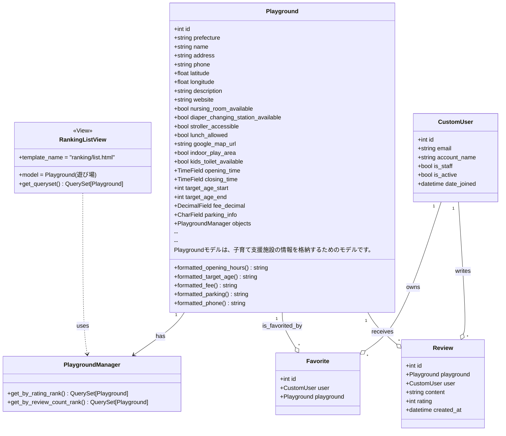

# UMLクラス図（Mermaid記法）

```mermaid
classDiagram
    class PlaygroundManager {
        +get_by_rating_rank() QuerySet[Playground]
        +get_by_review_count_rank() QuerySet[Playground]
    }
    class Playground {
        +int id
        +string prefecture
        +string name
        +string address
        +string phone
        +float latitude
        +float longitude
        +string description
        +string website
        +bool nursing_room_available
        +bool diaper_changing_station_available
        +bool stroller_accessible
        +bool lunch_allowed
        +string google_map_url
        +bool indoor_play_area
        +bool kids_toilet_available
        +TimeField opening_time
        +TimeField closing_time
        +int target_age_start
        +int target_age_end
        +DecimalField fee_decimal
        +CharField parking_info
        +PlaygroundManager objects
        --
        +formatted_opening_hours() string
        +formatted_target_age() string
        +formatted_fee() string
        +formatted_parking() string
        +formatted_phone() string
        --
        Playgroundモデルは、子育て支援施設の情報を格納するためのモデルです。
    }
    class RankingListView {
        <<View>>
        +model = Playground (遊び場)
        +template_name = "ranking/list.html"
        +get_queryset() QuerySet[Playground]
    }
    class Favorite {
        +int id
        +CustomUser user
        +Playground playground
    }
    class Review {
        +int id
        +Playground playground
        +CustomUser user
        +string content
        +int rating
        +datetime created_at
    }
    class CustomUser {
        +int id
        +string email
        +string account_name
        +bool is_staff
        +bool is_active
        +datetime date_joined
    }

    Playground "1" --> "1" PlaygroundManager : has
    RankingListView ..> PlaygroundManager : uses
    CustomUser "1" --o "*" Favorite : owns
    CustomUser "1" --o "*" Review : writes
    Playground "1" --o "*" Favorite : is_favorited_by
    Playground "1" --o "*" Review : receives
```

---

- CustomUserクラスは、メールアドレスを認証の主キーとするカスタムユーザーモデルです。
