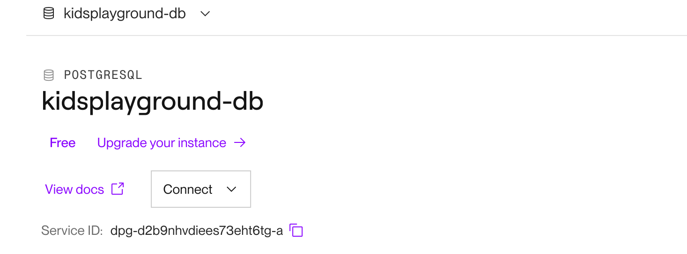
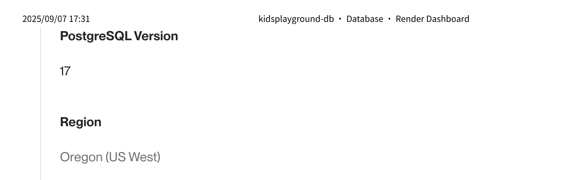

1. renderで新規DBを作成する



1. renderアプリのシークレットファイルのDATABASE-URLを新しいDBのInternal Database URLに更新する。

1. ローカルの.envファイルのRENDER_DATABASE_URLを新しいrenderDBのExternal Database URLに更新する

1. Dockerを起動する。
``` docker compose up -d ```

1. データを同期する
``` python3 manage.py sync_to_render ```
