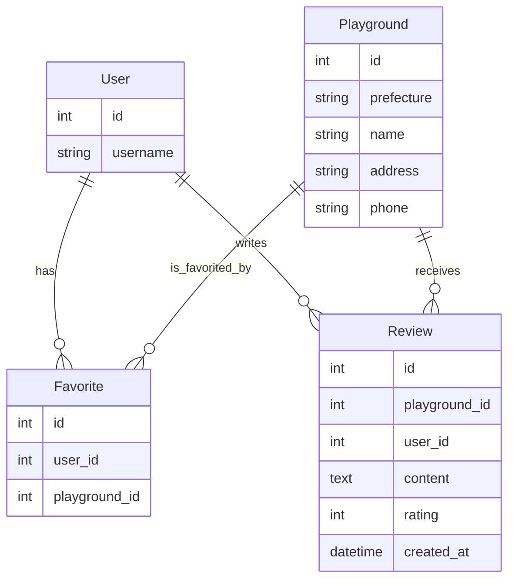

# データベース設計書

## ER図（Mermaid記法）

---

## 各テーブル（モデル）詳細

### Playground（施設）
| フィールド名 | 型              | 説明         |
|--------------|-----------------|--------------|
| id           | AutoField       | 主キー       |
| prefecture   | CharField(100)  | 都道府県名   |
| name         | CharField(200)  | 施設名       |
| address      | CharField(300)  | 住所         |
| phone        | CharField(30)   | 電話番号     |

### Favorite（お気に入り）
| フィールド名   | 型            | 説明               |
|----------------|---------------|--------------------|
| id             | AutoField     | 主キー             |
| user           | ForeignKey    | ユーザー           |
| playground     | ForeignKey    | お気に入りの施設   |

※ user, playgroundの組み合わせはユニーク制約

### Review（口コミ）
| フィールド名   | 型                | 説明               |
|----------------|-------------------|--------------------|
| id             | AutoField         | 主キー             |
| playground     | ForeignKey        | 口コミ対象の施設   |
| user           | ForeignKey        | 投稿ユーザー       |
| content        | TextField         | 口コミ内容         |
| rating         | PositiveInteger   | 評価（1〜5）       |
| created_at     | DateTimeField     | 投稿日時           |

---

## 注意事項
- UserモデルはDjango標準の`auth.User`を利用
- 外部キーは`on_delete=models.CASCADE`（親が消えると子も消える）
- Favoriteはuserとplaygroundの組み合わせで重複不可

