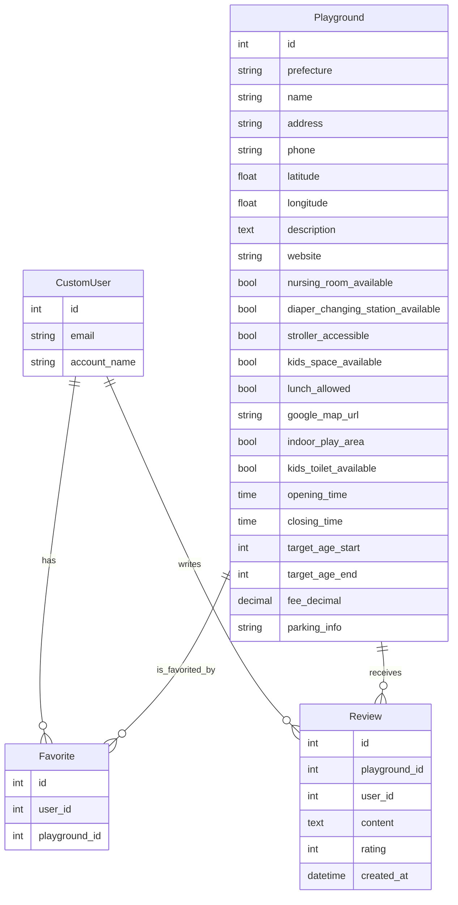

# データベース設計書

## ER図（Mermaid記法）

---

## 各テーブル（モデル）詳細

### CustomUser（カスタムユーザー）
| フィールド名 | 型              | 説明         |
|--------------|-----------------|--------------|
| id           | AutoField       | 主キー       |
| email        | EmailField      | メールアドレス（ユニーク） |
| account_name | CharField(50)   | アカウント名 |

### Playground（施設）
| フィールド名 | 型              | 説明         |
|--------------|-----------------|--------------|
| id           | AutoField       | 主キー       |
| prefecture   | CharField(100)  | 都道府県名   |
| name         | CharField(200)  | 施設名       |
| address      | CharField(300)  | 住所         |
| phone        | CharField(30)   | 電話番号     |
| latitude     | FloatField      | 緯度         |
| longitude    | FloatField      | 経度         |
| description  | TextField       | 施設説明     |
| website      | URLField        | ウェブサイトURL |
| nursing_room_available | BooleanField | 授乳室の有無 |
| diaper_changing_station_available | BooleanField | おむつ交換台の有無 |
| stroller_accessible | BooleanField | ベビーカーアクセス可否 |
| kids_space_available | BooleanField | キッズスペースの有無 |
| lunch_allowed | BooleanField    | 持ち込みランチ可否 |
| google_map_url | URLField      | GoogleマップURL |
| indoor_play_area | BooleanField  | 屋内遊び場の有無 |
| kids_toilet_available | BooleanField | 子供用トイレの有無 |
| opening_time | TimeField       | 開園時間     |
| closing_time | TimeField       | 閉園時間     |
| target_age_start | IntegerField  | 対象年齢（開始） |
| target_age_end | IntegerField  | 対象年齢（終了） |
| fee_decimal  | DecimalField    | 料金         |
| parking_info | CharField(10)   | 駐車場情報   |

### Favorite（お気に入り）
| フィールド名   | 型            | 説明               |
|----------------|---------------|--------------------|
| id             | AutoField     | 主キー             |
| user           | ForeignKey    | ユーザー           |
| playground     | ForeignKey    | お気に入りの施設   |

※ user, playgroundの組み合わせはユニーク制約

### Review（口コミ）
| フィールド名   | 型                | 説明               |
|----------------|-------------------|--------------------|
| id             | AutoField         | 主キー             |
| playground     | ForeignKey        | 口コミ対象の施設   |
| user           | ForeignKey        | 投稿ユーザー       |
| content        | TextField         | 口コミ内容         |
| rating         | PositiveInteger   | 評価（1〜5）       |
| created_at     | DateTimeField     | 投稿日時           |

---

## 注意事項
- CustomUserモデルを利用
- 外部キーは`on_delete=models.CASCADE`（親が消えると子も消える）
- Favoriteはuserとplaygroundの組み合わせで重複不可
