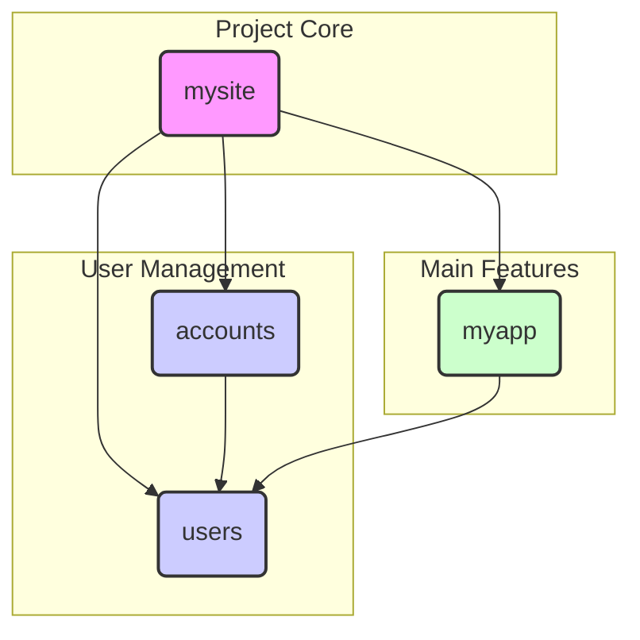

# 概要設計

## サイトの目的
子供が遊べる施設や子育て支援施設を一覧・地図で分かりやすく提供し、ユーザーが施設を検索・お気に入り登録できるWebサービスです。

## ターゲットユーザー
- 児童支援施設を探している保護者や支援者
- 施設運営者

## サイト全体構成（ページ一覧）
```mermaid
graph TD
    subgraph "Pages"
        TOP[トップページ]
        LOGIN[ログイン]
        REGISTER[会員登録]
        MYPAGE[マイページ]
        LIST[遊び場一覧 (地図機能含む)]
        DETAIL[遊び場詳細]
        FAVORITE[お気に入り一覧 (地図機能含む)]
        REVIEW_FORM[口コミ投稿]
        REVIEW_LIST[口コミ一覧]
        RANKING[ランキング]
        ABOUT[このサイトについて]
    end

    subgraph "API (内部動作)"
    end

    TOP --> LIST
    TOP --> LOGIN
    TOP --> REGISTER
    TOP --> RANKING
    TOP --> ABOUT

    LOGIN --> MYPAGE
    REGISTER --> MYPAGE
    MYPAGE --> FAVORITE

    LIST --> DETAIL
    DETAIL --> REVIEW_FORM
    DETAIL --> REVIEW_LIST
```

## アプリケーション構成


| アプリケーション | 役割                                                                                                                            |
|------------------|---------------------------------------------------------------------------------------------------------------------------------|
| `mysite`         | プロジェクト全体の設定 (`settings.py`) とURLディスパッチ (`urls.py`) を管理する中心的なアプリケーション。                         |
| `users`          | `email`をユーザー名とするカスタムユーザーモデル (`CustomUser`) を定義。                                                         |
| `accounts`       | `django-allauth` を利用したユーザー認証（登録、ログイン等）と、マイページなどのアカウント関連機能を提供する。                   |
| `myapp`          | 施設情報、口コミ、お気に入り、ランキングなど、このWebサービスの主要な機能を提供するコアアプリケーション。                         |

---

## 主なユースケース
- 遊び場を検索・一覧・地図で閲覧する
- 会員登録・ログインし、マイページやお気に入り管理を行う
- 遊び場の詳細情報や口コミを閲覧・投稿する
- ランキングで人気の施設を探す

## 機能一覧表
| 機能             | 概要                                                       |
|------------------|------------------------------------------------------------|
| 遊び場一覧         | 遊び場情報をリスト表示                                     |
| 地図表示         | 遊び場一覧とお気に入り一覧にLeaflet.jsで地図表示           |
| 遊び場詳細         | 遊び場の詳細情報・口コミ表示                             |
| ランキング表示   | 口コミに基づいた施設ランキング表示                       |
| 会員登録/ログイン | ユーザー認証                                               |
| マイページ       | お気に入り・投稿口コミ管理                                 |
| お気に入り登録   | 遊び場をお気に入りリストに追加/削除                      |
| 口コミ投稿     | 遊び場への口コミ投稿                                     |
| 口コミ一覧表示   | 施設ごとの口コミを一覧で表示                             |
| このサイトについて | サイトの目的や使い方を説明するページ                     |
