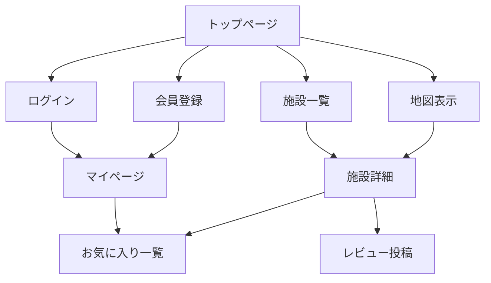

# 概要設計

## サイトの目的
児童支援施設の情報を一覧・地図で分かりやすく提供し、ユーザーが施設を検索・お気に入り登録できるWebサービスです。

## ターゲットユーザー
- 児童支援施設を探している保護者や支援者
- 施設運営者

## サイト全体構成（ページ一覧）

## 主なユースケース
- 施設を検索・一覧・地図で閲覧する
- 会員登録・ログインし、マイページやお気に入り管理を行う
- 施設の詳細情報やレビューを閲覧・投稿する

## 機能一覧表
| 機能             | 概要                                 |
|------------------|--------------------------------------|
| 施設一覧         | 施設情報をリスト表示                 |
| 地図表示         | Google Maps上に施設をマッピング     |
| 施設詳細         | 施設の詳細情報・レビュー表示         |
| ランキング表示   | 口コミに基づいた施設ランキング表示   |
| 会員登録/ログイン | ユーザー認証                        |
| マイページ       | お気に入り・投稿レビュー管理         |
| お気に入り登録   | 施設をお気に入りリストに追加/削除   |
| レビュー投稿     | 施設へのレビュー投稿                 |

