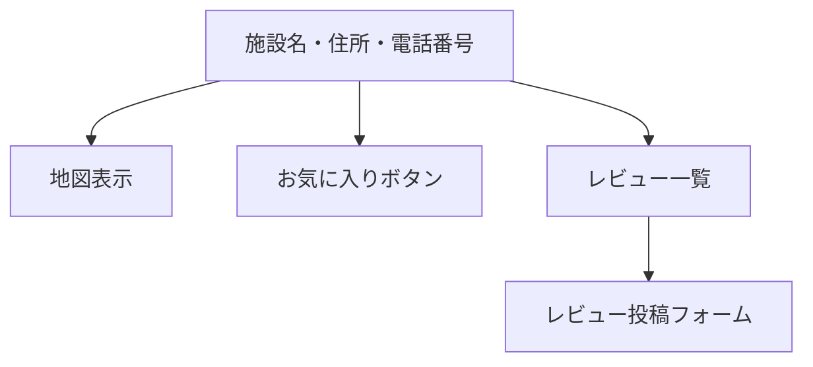

# 画面設計書

本システムの主要な画面構成と要素をまとめます。

---

## 画面一覧

| 画面名         | URL例                | 主な要素・機能                       |
|----------------|----------------------|--------------------------------------|
| トップ         | /                    | サイト説明、検索フォーム、ログイン/会員登録リンク |
| 施設一覧       | /playgrounds/        | 施設リスト、検索フォーム、地図表示リンク         |
| 施設詳細       | /playgrounds/1/      | 施設情報、地図、レビュー一覧、レビュー投稿フォーム、お気に入りボタン |
| ランキングページ | /ranking/            | 評価/口コミ数による施設ランキング           |
| マイページ     | /mypage/             | お気に入り一覧、投稿レビュー一覧、ユーザー情報   |
| ログイン       | /login/              | ログインフォーム、パスワードリセットリンク      |
| 会員登録       | /register/           | 会員登録フォーム                      |
| レビュー編集   | /reviews/edit/1/     | レビュー編集フォーム                  |

---

## 画面要素詳細

### トップページ
- サイトの説明
- 施設検索フォーム（都道府県・キーワードなど）
- ログイン/会員登録へのリンク

### 施設一覧ページ
- 施設リスト（名称・住所・地図リンク）
- 検索フォーム
- 地図表示へのリンク

### 施設詳細ページ
- 施設名、住所、電話番号、地図
- レビュー一覧
- レビュー投稿フォーム（ログイン時のみ）
- お気に入り登録/解除ボタン（ログイン時のみ）

### ランキングページ
- ページタイトル
- ランキングのソート順を切り替えるタブ（評価順 / 口コミ数順）
- ランキングリスト（順位、施設名、評価、口コミ数）

### マイページ
- ユーザー情報
- お気に入り施設一覧（施設名・リンク・削除ボタン）
- 投稿したレビュー一覧（編集・削除ボタン）

### ログインページ
- ユーザー名・パスワード入力フォーム
- パスワードリセットへのリンク

### 会員登録ページ
- ユーザー名・メールアドレス・パスワード入力フォーム
- 登録ボタン

### レビュー編集ページ
- レビュー内容・評価の編集フォーム
- 保存・キャンセルボタン

---

## ワイヤーフレーム例（Mermaid記法）

### 施設詳細ページ例

---

