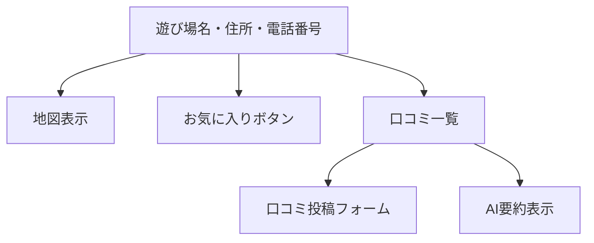

# 画面設計書

本Webアプリケーションの主要な画面構成と要素をまとめます。

---

## 画面一覧

| 画面名             | URL例                   | 主な要素・機能                                       |
|--------------------|-------------------------|------------------------------------------------------|
| トップページ/遊び場一覧 | /                       | サイト説明、遊び場リスト、詳細な検索フォーム、地図表示 |
| 遊び場詳細         | /facilities/1/          | 遊び場情報、地図、口コミ一覧、口コミ投稿フォーム、お気に入りボタン |
| ランキングページ   | /ranking/               | 評価/口コミ数による施設ランキング                    |
| このサイトについて | /about/                 | サイトの目的や使い方を説明                           |
| マイページ         | /accounts/mypage/       | お気に入り一覧、投稿レビュー一覧、ユーザー情報         |
| ログイン           | /accounts/login/        | ログインフォーム、パスワードリセットリンク           |
| 会員登録           | /accounts/signup/       | 会員登録フォーム                                     |

---

## 画面要素詳細

### トップページ / 遊び場一覧ページ
- 遊び場リスト（名称・住所など）
- 地図表示（遊び場リストと統合）
- 詳細な検索・フィルタリングフォーム
  - キーワード、住所
  - 駐車場（有無、無料/有料）
  - 対象年齢（範囲指定）
  - 料金（範囲指定）
  - 設備・特徴（授乳室、おむつ交換台、ベビーカー可、飲食可、屋内遊び場、子供用トイレ）

### 遊び場詳細ページ
- 遊び場名、住所、電話番号、地図
- 口コミ一覧と、AIによる要約
- 口コミ投稿フォーム（ログイン時のみ）
- お気に入り登録/解除ボタン（ログイン時のみ）

### ランキングページ
- ページタイトル
- ランキングのソート順を切り替えるタブ（評価順 / 口コミ数順）
- ランキングリスト（順位、遊び場名、評価、口コミ数）

### マイページ
- ユーザー情報
- お気に入り遊び場一覧（遊び場名・リンク・削除ボタン）
- 投稿した口コミ一覧（編集・削除ボタン）

### ログインページ
- ユーザー名・パスワード入力フォーム
- パスワードリセットへのリンク

### 会員登録ページ
- ユーザー名・メールアドレス・パスワード入力フォーム
- 登録ボタン

---

## ワイヤーフレーム例（Mermaid記法）

### 遊び場詳細ページ例

---
