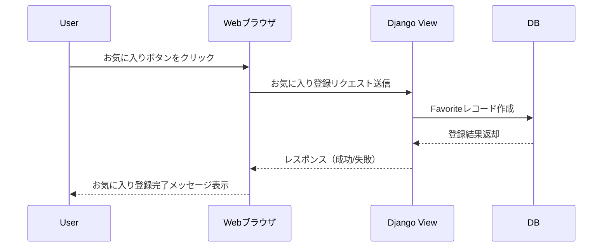
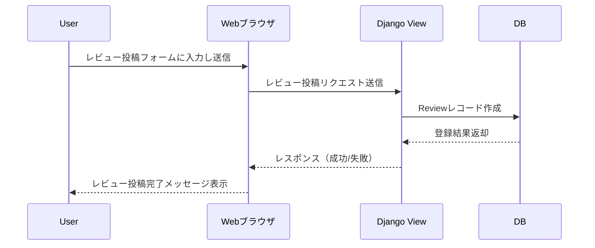
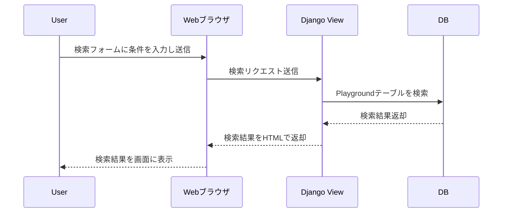
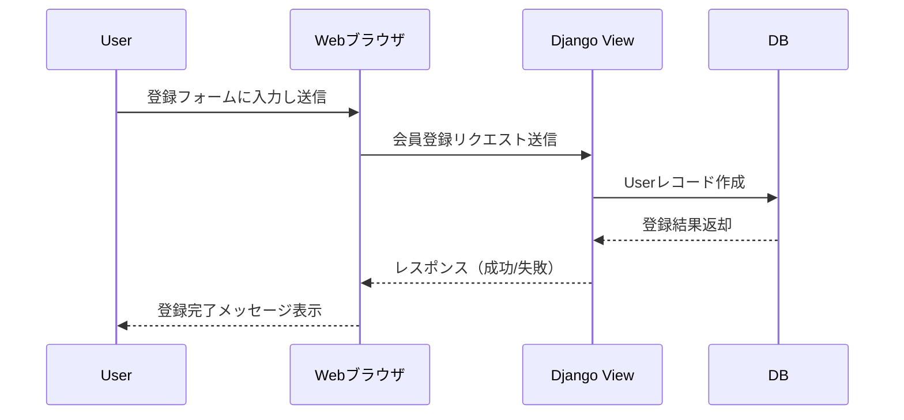
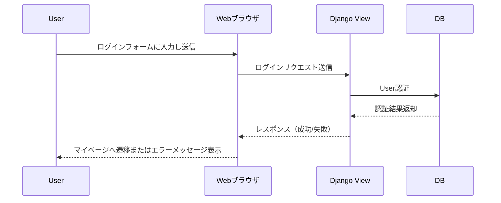
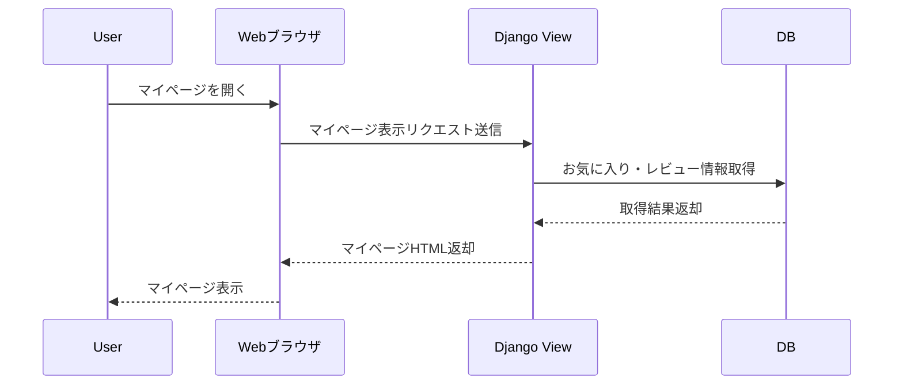
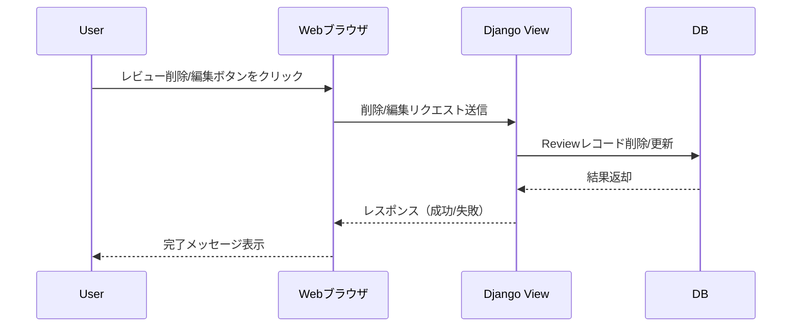
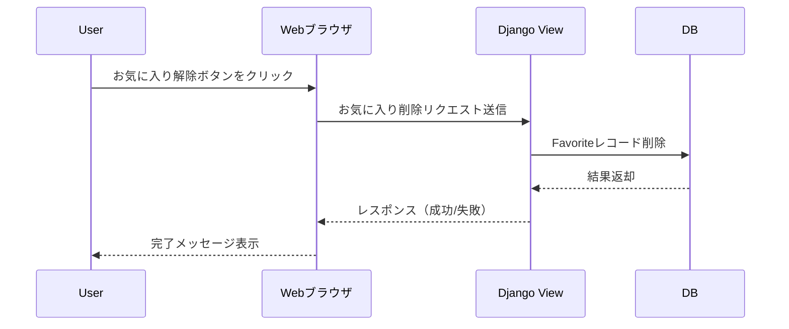

# シーケンス図（Mermaid記法）

## 例：ユーザーがお気に入り登録を行う場合

---

## 例：ユーザーがレビューを投稿する場合

---

## 例：ユーザーが施設を検索する場合

---

## 例：ユーザーが新規会員登録を行う場合

---

## 例：ユーザーがログインする場合

---

## 例：ユーザーがマイページを表示する場合

---

## 例：ユーザーがレビューを削除・編集する場合

---

## 例：ユーザーがお気に入りを削除する場合

---
